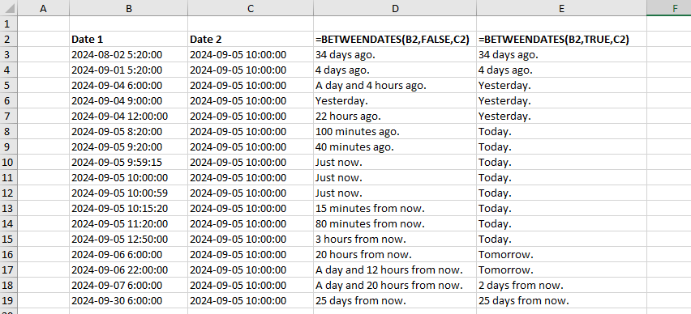

## Between Dates

An Excel function that displays the interval between two dates in text form. See the example below.

By default, both date and time of day are taken into consideration. 
The parameter RoundToDays can be optionally set to True, causing the function to ignore the precise time of day.

If only one date is specified, the function will calculate the interval between the given date and current system time.

